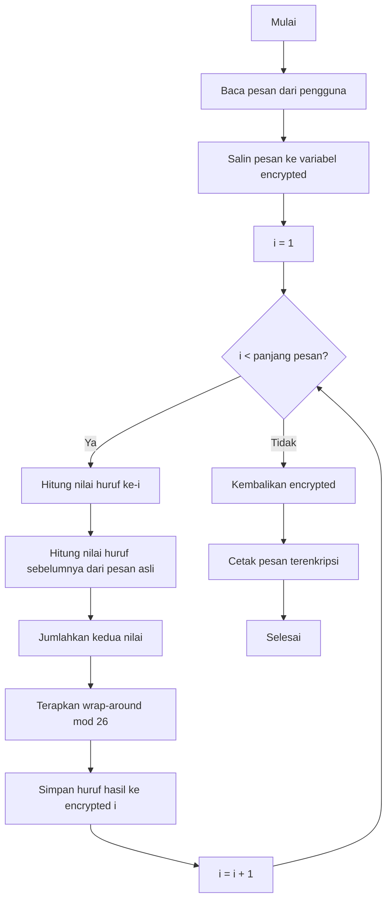
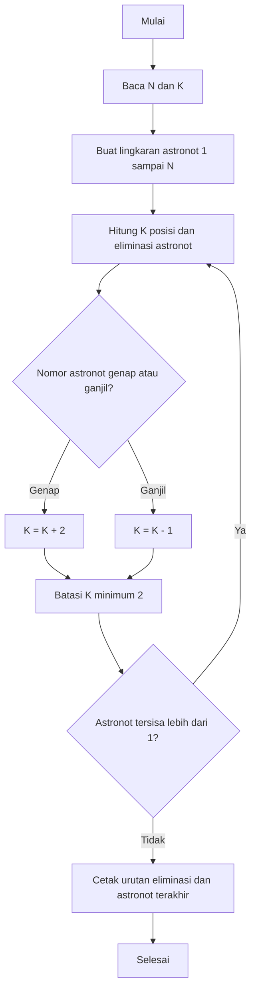

# Space Mission: Alien Cipher & The Last Astronaut

Repository ini berisi dua program simulasi bertema misi luar angkasa:

1. **Alien Cipher** — sistem enkripsi pesan berbasis huruf sebelumnya.
2. **The Last Astronaut** — simulasi eliminasi astronot melingkar (varian masalah Josephus) dengan aturan nilai K yang dinamis.

---

## 1. Alien Cipher

### Deskripsi

Program ini mengenkripsi sebuah pesan dengan aturan berikut:

- Huruf pertama pada pesan **tidak berubah**.
- Setiap huruf setelahnya digeser (shift) berdasarkan nilai alfabet dari **huruf sebelumnya pada pesan asli** (A=1, B=2, ..., Z=26).
- Jika hasil pergeseran melewati Z (lebih dari 26), perhitungan akan berputar kembali mulai dari A.

**Contoh:**

| Pesan asli | `ALIENS` |
|---|---|
| Pesan terenkripsi | `AMUNSG` |

### Pseudocode

```
FUNCTION encryptMessage(message):
    SET encrypted = copy of message

    FOR i FROM 1 TO length(message) - 1:
        currentValue = ALPHABET_POSITION(message[i])       // A=1, B=2, ..., Z=26
        precedingValue = ALPHABET_POSITION(message[i - 1]) // menggunakan huruf ASLI, bukan hasil enkripsi

        shifted = currentValue + precedingValue

        // wrap around jika melewati 26, kembali ke 1
        shifted = ((shifted - 1) MOD 26) + 1

        encrypted[i] = LETTER_FROM_POSITION(shifted)

    RETURN encrypted


FUNCTION ALPHABET_POSITION(letter):
    RETURN (UPPERCASE(letter) - 'A') + 1


FUNCTION LETTER_FROM_POSITION(value):
    RETURN 'A' + (value - 1)


MAIN:
    PRINT "Enter the message to encrypt: "
    READ message

    result = encryptMessage(message)

    PRINT "Encrypted message: " + result
```

### Flowchart



### Penjelasan Kode `.cpp`

| Bagian Kode | Penjelasan |
|---|---|
| `string encrypted = message;` | Menyalin pesan asli agar huruf pertama otomatis tidak berubah. |
| `for (size_t i = 1; ...)` | Loop dimulai dari indeks 1, melewati huruf pertama. |
| `toupper(message[i]) - 'A' + 1` | Mengonversi huruf menjadi nilai posisi alfabet (A=1 ... Z=26), menggunakan `toupper` agar input huruf kecil/besar tetap konsisten. |
| `message[i - 1]` | **Penting:** selalu mengambil huruf sebelumnya dari `message` (pesan asli), bukan dari `encrypted`, sesuai aturan cipher. |
| `((shifted - 1) % 26) + 1` | Logika wrap-around: menggeser sementara ke rentang 0–25 agar modulo bekerja benar, lalu dikembalikan ke rentang 1–26. |
| `encrypted[i] = 'A' + (shifted - 1);` | Mengonversi kembali nilai numerik menjadi karakter huruf. |

---

## 2. The Last Astronaut

### Deskripsi

Program ini mensimulasikan proses eliminasi astronot yang berdiri melingkar, mirip dengan **masalah Josephus**, namun dengan aturan tambahan:

- Penghitungan dimulai dari astronot nomor 1.
- Astronot yang menerima hitungan ke-**K** akan dieliminasi.
- Setelah eliminasi, hitungan berikutnya dimulai dari astronot **tepat setelah** posisi yang dieliminasi.
- Nilai K berubah setiap kali ada eliminasi:
  - Jika nomor astronot yang dieliminasi **genap** → K bertambah 2.
  - Jika nomor astronot yang dieliminasi **ganjil** → K berkurang 1.
  - K tidak boleh kurang dari 2 — jika terjadi, K dipaksa menjadi 2.
- Proses berlanjut hingga hanya tersisa satu astronaut.

### Pseudocode

```
FUNCTION findLastAstronaut(N, K):
    astronauts = [1, 2, 3, ..., N]
    eliminationOrder = []
    currentIndex = 0

    WHILE length(astronauts) > 1:
        size = length(astronauts)
        eliminatedIndex = (currentIndex + K - 1) MOD size
        eliminatedNumber = astronauts[eliminatedIndex]

        APPEND eliminatedNumber TO eliminationOrder
        REMOVE astronauts[eliminatedIndex]

        IF eliminatedNumber MOD 2 == 0:
            K = K + 2
        ELSE:
            K = K - 1

        IF K < 2:
            K = 2

        IF astronauts is empty:
            BREAK

        currentIndex = eliminatedIndex MOD length(astronauts)

    RETURN eliminationOrder, astronauts[0]


MAIN:
    READ N, K
    (eliminationOrder, survivor) = findLastAstronaut(N, K)
    PRINT eliminationOrder
    PRINT survivor
```

### Flowchart



### Penjelasan Kode `.cpp`

| Bagian Kode | Penjelasan |
|---|---|
| `vector<int> astronauts` | Menyimpan nomor astronot 1 sampai N yang mewakili lingkaran. |
| `(currentIndex + k - 1) % size` | Menghitung K posisi maju dari `currentIndex`, dengan `%` menangani perputaran melingkar. |
| `astronauts.erase(...)` | Menghapus astronot yang tereliminasi dari lingkaran. |
| `if (eliminatedNumber % 2 == 0) k += 2; else k -= 1;` | Menerapkan aturan perubahan nilai K berdasarkan paritas nomor yang dieliminasi. |
| `if (k < 2) k = 2;` | Menjamin K tidak pernah kurang dari 2. |
| `currentIndex = eliminatedIndex % astronauts.size();` | **Kunci logika:** karena `.erase()` menggeser semua elemen setelah yang dihapus mundur satu posisi, indeks yang sama kini menunjuk ke astronot yang tadinya berada tepat setelah yang dieliminasi. |
| `while (astronauts.size() > 1)` | Loop berhenti otomatis saat hanya tersisa satu astronot. |

---

## Cara Menjalankan

```bash
g++ -o cipher cipher.cpp
./cipher

g++ -o astronaut astronaut.cpp
./astronaut
```

## Struktur Program

```
.
├── cipher.cpp       # Program enkripsi pesan alien
├── astronaut.cpp    # Program simulasi eliminasi astronot
└── README.md
```
